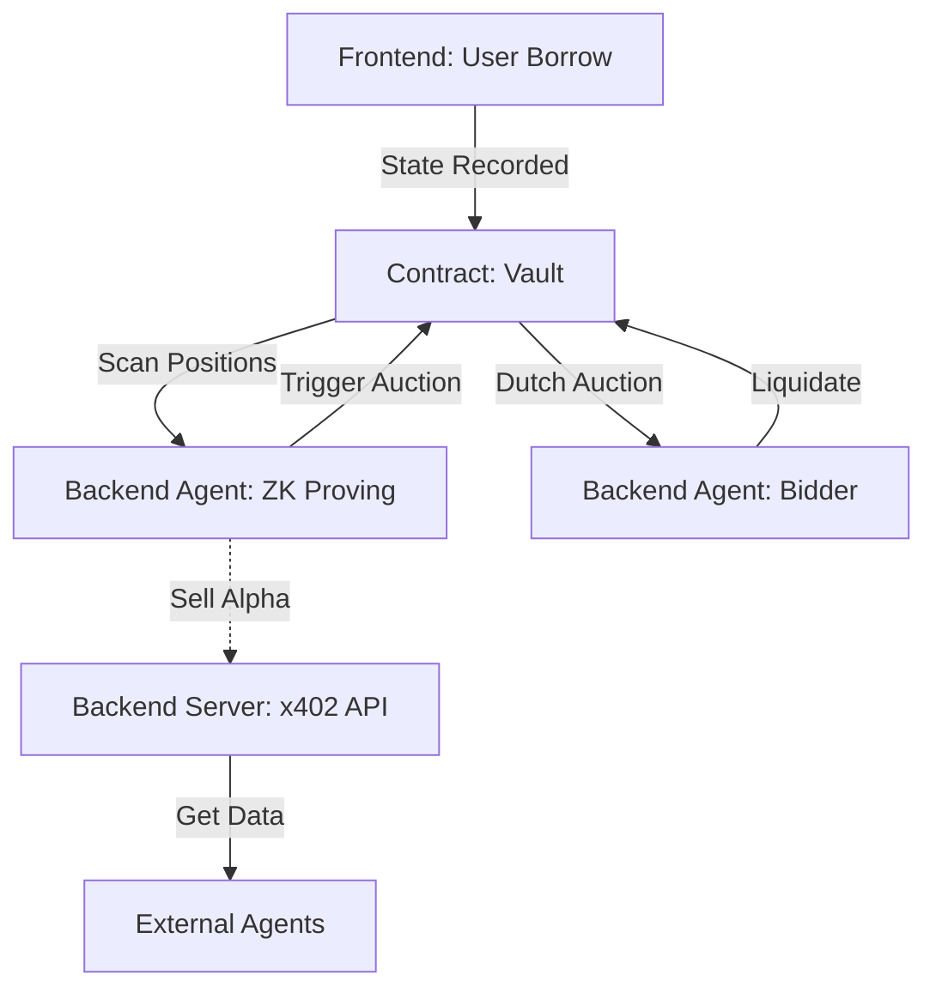

# Argen: Agentic Liquidation Protocol

Argen is an autonomous lending protocol on Stellar that leverages **ZK-Proofs**
and **x402 payments** to enable a self-sustaining, hyper-efficient agentic
economy.

---

## 🔗 Deployed Contracts (Stellar Testnet)

You can explore our deployed smart contracts directly on stellar.expert:

- **Vault:**
  [`CBNXMW4QDJS77SRB6URZKFF4ZDAQXYLMRTLLPIJEBZYI3U3EJSPZU4BG`](https://stellar.expert/explorer/testnet/contract/CBNXMW4QDJS77SRB6URZKFF4ZDAQXYLMRTLLPIJEBZYI3U3EJSPZU4BG)
- **vUSDC:**
  [`CDEMATCS43COZGOQJFC5UZEA7GOY5CUQATKMFMJGKIP7B2USBS3RJ6KZ`](https://stellar.expert/explorer/testnet/contract/CDEMATCS43COZGOQJFC5UZEA7GOY5CUQATKMFMJGKIP7B2USBS3RJ6KZ)
- **ZK Verifier:**
  [`CDGYLCFDRHFUIGJ2A2BZ3X5BJRHVBLSEJ4DYHGRBPAYJ7YQLOVW72XR5`](https://stellar.expert/explorer/testnet/contract/CDGYLCFDRHFUIGJ2A2BZ3X5BJRHVBLSEJ4DYHGRBPAYJ7YQLOVW72XR5)
- **USDC (Circle Testnet):**
  [`CBIELTK6YBZJU5UP2WWQEUCYKLPU6AUNZ2BQ4WWFEIE3USCIHMXQDAMA`](https://stellar.expert/explorer/testnet/contract/CBIELTK6YBZJU5UP2WWQEUCYKLPU6AUNZ2BQ4WWFEIE3USCIHMXQDAMA)
- **XLM SAC:**
  [`CDLZFC3SYJYDZT7K67VZ75HPJVIEUVNIXF47ZG2FB2RMQQVU2HHGCYSC`](https://stellar.expert/explorer/testnet/contract/CDLZFC3SYJYDZT7K67VZ75HPJVIEUVNIXF47ZG2FB2RMQQVU2HHGCYSC)

---

## 🎯 Protocol Lifecycle

The end-to-end flow of Argen is distributed across the Frontend, Backend
(Agents), and Soroban Smart Contracts.

### 1. The Core Lifecycle: Borrowing & Collateral

- **User Action (Frontend):** A user connects their wallet and deposits XLM as
  collateral to borrow USDC.
- **The Engine (Contract):** The **Vault Contract (Soroban)** records the debt,
  issues `vUSDC` (yield-bearing yield), and tracks the "Health Factor."

### 2. The Watchtower: Health Monitoring

- **The Scout (Backend - Agent):** An autonomous **Monitor Agent** runs in a
  continuous loop. It scans all open positions on the vault contract using RPC
  calls.
- **ZK-Proof Generation (Backend):** Instead of the contract doing heavy math,
  the Agent generates a **ZK Health-Factor Proof** locally. This proves a
  position is undercollateralized without the contract needing to fetch external
  price feeds directly.

### 3. The Marketplace: x402 Data API

- **Gated Discovery (Backend - Server):** The server hosts the **x402 Agentic
  API**.
- **The Economy:** External agents pay for high-alpha liquidation data.
  1. **Challenge:** External client calls `GET /opportunities`. Server returns
     `402 Payment Required`.
  2. **Payment:** Client pays **0.05 USDC** via Stellar to the protocol wallet.
  3. **Data:** Server verifies payment via the OpenZeppelin Facilitator and
     serves the list of at-risk positions.
- **Impact:** Argen monetizes your protocol’s monitoring intelligence.

### 4. The Trigger: Automatic Liquidation

- **Action (Backend - Agent):** When an agent identifies a bad position, it
  calls `trigger_auction` on the contract, submitting the ZK Proof as evidence.
- **Reward (Contract → Backend):** The contract verifies the proof. If valid, it
  immediately pays a **1% Trigger Fee** (in USDC) to the Agent’s wallet.

### 5. The Auction: Dutch Auction Bidding

- **The Descent (Contract):** The contract starts a **Dutch Auction**. The price
  of seized XLM collateral drops monotonically over time.
- **The Bid (Backend - Agent):** A **Bidder Agent** watches the auction,
  calculates the decaying price, and waits for a specific profit margin.
- **The Strike:** When the price hits the `MIN_PROFIT_THRESHOLD` (e.g., 2%
  discount), the Agent generates a **ZK Auction-Price Proof** and submits a bid
  to claim the collateral.

---

## 🆚 Argen vs. Aave: The Next Evolution of DeFi

In traditional borrowing/lending systems like **Aave**:

- **Oracle Bloat:** Aave heavily relies on continuously pushing expensive, rigid
  Oracle updates directly onto the chain so the smart contracts can calculate
  the health factor of every single borrower recursively.
- **Free-Rider Problem:** Multi-million dollar protocols usually host extremely
  expensive infrastructure and free API endpoints just to allow MEV bots and
  indexers to scout their data for free.

**How Argen Changes the Game with ZK and x402:**

1. **Zero-Knowledge Local Computations:** Argen explicitly offloads the heavy
   mathematical evaluations completely off-chain. Agents individually compute
   borrower health factors using `health_factor.wasm` proofs! The Soroban
   contract no longer calculates prices—it strictly acts as an ultra-fast **ZK
   Verifier**. This entirely eliminates "Oracle bloat" and saves vast amounts of
   transaction fees on the network.
2. **x402 Micro-Monetization:** Instead of giving away indexing and position
   data for free via open subgraphs, Argen pioneers the `x402` payment standard.
   It transforms the protocol into a decentralized data-marketplace,
   fundamentally forcing AI agents and arbitrage bots to pay microscopic
   Stellar-based fees upfront just to _read_ the data required to perform their
   liquidations.
3. **Crowd-Sourced Subcontracting:** We transform MEV extractors from parasitic
   front-runners into paying customers and decentralized workers working
   explicitly to keep the protocol seamlessly solvent!

---

## 🤖 Ecosystem & Marketplace Dynamics

Argen is designed as a **Competitive Marketplace** where the protocol owner
profits from both their own automation and third-party participation.

### 1. The External Builder (The "Alpha-Seeker")

External developers can participate in the protocol's liquidation economy
without building a full monitoring stack from scratch.

- **Data Purchase:** External agents pay the protocol owner **0.05 USDC** per
  request via the **x402 API** to receive the latest list of liquidation
  opportunities.
- **The Race:** Armed with this data, external agents compete on-chain to
  trigger auctions.
- **Win-Win:** If an external agent wins the 1% trigger fee, the protocol owner
  still collects the API fee. The protocol turns "competitors" into "paying
  customers."

### 2. The Borrower (The "User")

- **Risk Visibility:** Users use the dashboard to monitor their **Safety
  Score**. Tooltips provide clear explanations of liquidation thresholds.
- **Protocol Resilience:** The presence of multiple agents (internal and
  external) ensures that bad debt is cleared immediately, maintaining protocol
  solvency and user trust.

### 3. Crowd-Sourced Security

By selling high-fidelity data via x402, Argen ensures a **Self-Healing Financial
System**. There are always "scouts" looking for bad debt, ensuring the protocol
is never under-collateralized even during extreme market volatility.

---

## 🛠 Technical Stack

| Component            | Responsibility                           | Technology         |
| :------------------- | :--------------------------------------- | :----------------- |
| **Contract**         | Source of Truth, Debt Matching, Auctions | Soroban (Rust)     |
| **Backend (Agent)**  | Monitoring, ZK-Proving, Bidding          | Node.js / SnarkJS  |
| **Backend (Server)** | x402 Marketplace, API Handlers           | Express / x402     |
| **Frontend**         | Dashboard, User Borrowing, Agent Status  | Next.js / Tailwind |

---

## 📉 Project Flow



---

## ⚡️ Getting Started

### 1. Smart Contracts

Deploy the protocol to Stellar Testnet:

```bash
sh deploy.sh
```

### 2. Autonomous Agent & x402 Server

```bash
cd agent
# copy the values from the Pool Addresses section in frontend
export VAULT_CONTRACT_ID="CBNX..."
export VUSDC_CONTRACT_ID="CDEM..."
export ZK_VERIFIER_CONTRACT_ID="CDGY..."

# role: monitor | bidder
# Note: Roles are exclusive. Run two instances to do both.
export AGENT_ROLE="monitor"

pnpm run start:server   # Starts the gated x402 API
pnpm run start:agent    # Starts the agent loop
```

### 3. Frontend Dashboard

```bash
cd frontend
pnpm run dev
```

---

# Argen: Agentic Liquidation Protocol

Argen is an autonomous lending protocol on Stellar that leverages ZK-Proofs and
x402 payments to enable a self-sustaining agentic economy.

## Protocol Lifecycle

The end-to-end flow of LiquidMind is distributed across the Frontend, Backend
(Agents), and Soroban Smart Contracts.

### 1. The Core Lifecycle: Borrowing & Collateral

- **User Action (Frontend):** A user connects their wallet and deposits XLM as
  collateral to borrow USDC.
- **The Engine (Contract):** The **Vault Contract (Soroban)** records the debt,
  issues `vUSDC` (yield-bearing), and tracks the "Health Factor."

### 2. The Watchtower: Health Monitoring

- **The Scout (Backend - Agent):** An autonomous **Monitor Agent** runs in a
  continuous loop. It scans all open positions on the vault contract using RPC
  calls. (Note: Monitor agents strictly handle triggering and do not participate
  in bidding).
- **ZK-Proof Generation (Backend):** Instead of the contract doing heavy math,
  the Agent generates a **ZK Health-Factor Proof** locally. This proves a
  position is undercollateralized without the contract needing to fetch external
  price feeds directly.

### 3. The Marketplace: x402 Data API

- **Gated Discovery (Backend - Server):** The server hosts the **x402 Agentic
  API**.
- **The Economy:** External agents pay for high-alpha liquidation data.
  1.  **Challenge:** External client calls `GET /opportunities`. Server returns
      `402 Payment Required`.
  2.  **Payment:** Client pays **0.05 USDC** via Stellar to your wallet.
  3.  **Data:** Server verifies payment via the OpenZeppelin Facilitator and
      serves the list of at-risk positions.
- **Impact:** You monetize your protocol’s monitoring intelligence.

### 4. The Trigger: Automatic Liquidation

- **Action (Backend - Agent):** When an agent identifies a bad position, it
  calls `trigger_auction` on the contract, submitting the ZK Proof as evidence.
- **Reward (Contract → Backend):** The contract verifies the proof. If valid, it
  immediately pays a **1% Trigger Fee** (in USDC) to the Agent’s wallet.

### 5. The Auction: Dutch Auction Bidding

- **The Descent (Contract):** The contract starts a **Dutch Auction**. The price
  of seized XLM collateral drops every second.
- **The Bid (Backend - Agent):** A **Bidder Agent** watches the auction,
  calculates the decaying price, and waits for a specific profit margin.
- **The Strike:** When the price hits your `MIN_PROFIT_THRESHOLD` (e.g., 2%
  discount), the Agent generates a **ZK Auction-Price Proof** and submits a bid
  to claim the collateral. (Note: Bidder agents strictly handle auctions and do
  not participate in position monitoring/triggering).

---

## Ecosystem & Marketplace Dynamics

LiquidMind is designed as a **Competitive Marketplace** where the protocol owner
profits from both their own automation and third-party participation.

### 1. The External Builder (The "Alpha-Seeker")

External developers can participate in the protocol's liquidation economy
without building a full monitoring stack from scratch.

- **Data Purchase:** External agents pay the protocol owner **0.05 USDC** per
  request via the **x402 API** to receive the latest list of liquidation
  opportunities.
- **The Race:** Armed with this data, external agents compete on-chain to
  trigger auctions.
- **Win-Win:** If an external agent wins the 1% trigger fee, the protocol owner
  still collects the API fee. The protocol turns "competitors" into "paying
  customers."

### 2. The Borrower (The "User")

A normal human who borrows USDC from the protocol.

- **Risk Visibility:** Users use the dashboard to monitor their **Safety
  Score**. Tooltips provide clear explanations of liquidation thresholds.
- **Protocol Resilience:** The presence of multiple agents (internal and
  external) ensures that bad debt is cleared immediately, maintaining protocol
  solvency and user trust.

### 3. Crowd-Sourced Security

By selling high-fidelity data via x402, LiquidMind ensures a **Self-Healing
Financial System**. There are always "scouts" looking for bad debt, ensuring the
protocol is never under-collateralized even during extreme market volatility.

---

## Technical Stack

| Component            | Responsibility                           | Technology         |
| :------------------- | :--------------------------------------- | :----------------- |
| **Contract**         | Source of Truth, Debt Matching, Auctions | Soroban (Rust)     |
| **Backend (Agent)**  | Monitoring, ZK-Proving, Bidding          | Node.js / SnarkJS  |
| **Backend (Server)** | x402 Marketplace, API Handlers           | Express / x402     |
| **Frontend**         | Dashboard, User Borrowing, Agent Status  | Next.js / Tailwind |

---

## The Project Flow


**Flow Summary:** `Frontend (Borrow)` → `Contract (State)` →
`Backend Agent (Proof)` → `Backend Server (Data Sale)` →
`Contract (Auction/Settlement)`

---

## ⚡️ Getting Started

### 1. Smart Contracts

Deploy the protocol to Stellar Testnet:

```bash
sh deploy.sh
```

### 2. Autonomous Agent & x402 Server

Configure your `.env` with the `VAULT_CONTRACT_ID` and run:

```bash
cd agent
pnpm install

# role: monitor | bidder
# Note: Roles are exclusive. Run two instances to do both.
export AGENT_ROLE="monitor"

pnpm run start:server   # Starts the gated x402 API
pnpm run start:agent    # Starts the agent loop
```

### 3. Frontend Dashboard

```bash
pnpm install
pnpm run dev
```
