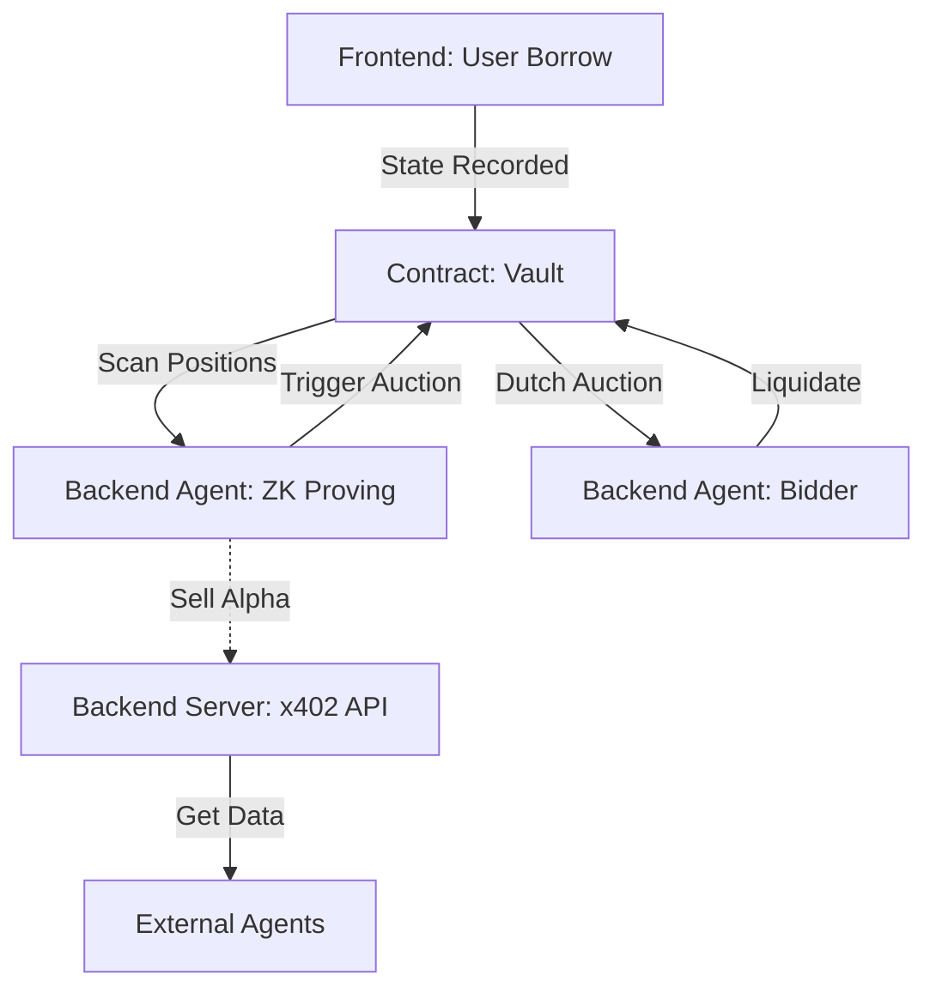

# LiquidMind: Agentic Liquidation Protocol

LiquidMind is an autonomous lending protocol on Stellar that leverages ZK-Proofs
and x402 payments to enable a self-sustaining agentic economy.

## Protocol Lifecycle

The end-to-end flow of LiquidMind is distributed across the Frontend, Backend
(Agents), and Soroban Smart Contracts.

### 1. The Core Lifecycle: Borrowing & Collateral

- **User Action (Frontend):** A user connects their wallet and deposits XLM as
  collateral to borrow USDC.
- **The Engine (Contract):** The **Vault Contract (Soroban)** records the debt,
  issues `vUSDC` (yield-bearing), and tracks the "Health Factor."

### 2. The Watchtower: Health Monitoring

- **The Scout (Backend - Agent):** An autonomous **Monitor Agent** runs in a
  continuous loop. It scans all open positions on the vault contract using RPC
  calls.
- **ZK-Proof Generation (Backend):** Instead of the contract doing heavy math,
  the Agent generates a **ZK Health-Factor Proof** locally. This proves a
  position is undercollateralized without the contract needing to fetch external
  price feeds directly.

### 3. The Marketplace: x402 Data API

- **Gated Discovery (Backend - Server):** The server hosts the **x402 Agentic
  API**.
- **The Economy:** External agents pay for high-alpha liquidation data.
  1.  **Challenge:** External client calls `GET /opportunities`. Server returns
      `402 Payment Required`.
  2.  **Payment:** Client pays **0.05 USDC** via Stellar to your wallet.
  3.  **Data:** Server verifies payment via the OpenZeppelin Facilitator and
      serves the list of at-risk positions.
- **Impact:** You monetize your protocol’s monitoring intelligence.

### 4. The Trigger: Automatic Liquidation

- **Action (Backend - Agent):** When an agent identifies a bad position, it
  calls `trigger_auction` on the contract, submitting the ZK Proof as evidence.
- **Reward (Contract → Backend):** The contract verifies the proof. If valid, it
  immediately pays a **1% Trigger Fee** (in USDC) to the Agent’s wallet.

### 5. The Auction: Dutch Auction Bidding

- **The Descent (Contract):** The contract starts a **Dutch Auction**. The price
  of seized XLM collateral drops every second.
- **The Bid (Backend - Agent):** A **Bidder Agent** watches the auction,
  calculates the decaying price, and waits for a specific profit margin.
- **The Strike:** When the price hits your `MIN_PROFIT_THRESHOLD` (e.g., 2%
  discount), the Agent generates a **ZK Auction-Price Proof** and submits a bid
  to claim the collateral.

---

## Technical Stack

| Component            | Responsibility                           | Technology         |
| :------------------- | :--------------------------------------- | :----------------- |
| **Contract**         | Source of Truth, Debt Matching, Auctions | Soroban (Rust)     |
| **Backend (Agent)**  | Monitoring, ZK-Proving, Bidding          | Node.js / SnarkJS  |
| **Backend (Server)** | x402 Marketplace, API Handlers           | Express / x402     |
| **Frontend**         | Dashboard, User Borrowing, Agent Status  | Next.js / Tailwind |

---

## The Project Flow



**Flow Summary:** `Frontend (Borrow)` → `Contract (State)` →
`Backend Agent (Proof)` → `Backend Server (Data Sale)` →
`Contract (Auction/Settlement)`

---

## ⚡️ Getting Started

### 1. Smart Contracts

Deploy the protocol to Stellar Testnet:

```bash
sh deploy.sh
```

### 2. Autonomous Agent & x402 Server

Configure your `.env` with the `VAULT_CONTRACT_ID` and run:

```bash
cd agent
pnpm install
pnpm run start:server   # Starts the gated x402 API
pnpm run start:agent    # Starts the monitoring/bidding loop
```

### 3. Frontend Dashboard

```bash
pnpm install
pnpm run dev
```
